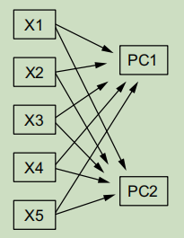

```{=html}
<style>body{text-align: justify;}</style>
```

```{r setup, include=FALSE}
knitr::opts_chunk$set(echo = TRUE)
```

## Introducción

El dengue es una enfermedad viral aguda causada por el virus del dengue (*DENV*), que se transmite a los seres humanos a través de la picadura de mosquitos hembra infectados (*Aedes aegypti*). Esta enfermedad se ha convertido a finales del siglo *XX* y a lo largo del siglo *XXI* en un problema de salud pública en muchas regiones tropicales y subtropicales del mundo. El mayor número de casos de dengue se registró en 2023, con la notificación de 6,5 millones de casos y más de 7 300 muertes relacionadas con la enfermedad, afectando a más de 80 países de todas las regiones de la OMS[@INS2024]. Los diferentes factores demográficos , en el entorno y sociales influyen en la propagación de la enfermedad, por ejemplo, el cambio climático(por ejemplo *El Niño* en 2023) ha incrementado el patrón y frecuencia de precipitaciones en las regiones de América Latina, así como el aumento de la temperatura, lo que ha permitido la proliferación de los mosquitos que transmiten la enfermedad.

En Colombia el dengue ha tenido una fluctuación en cuanto a los casos de dengue en los últimos años, pero, en 2023, inició una nueva fase epidémica de dengue similar a lo observado en algunos países de la región de Américas. Durante este año la incidencia en el país fue de 387,2 casos por 100 000 habitantes superior a la registrada en 2009, 2011, 2012, 2017, 2018, 2021 y 2022; y la letalidad por dengue fue de 0,09 % inferior a las metas establecidas por el gobierno local[@INS2024]. Por lo cual, en nuestro país el dengue se considera un problema de salud pública y se han implementado diferentes estrategias para la prevención y control de la enfermedad debido al potencial epidemiológico de la enfermedad, además, que en el país el vector transmisor de la enfermedad tiene presencia prácticamente todo el país.

El dengue es una enfermedad que supone un riesgo para la salud pública en lugares como Bucaramanga. Es necesario realizar un estudio a partir de los datos reportados a partir de las fichas de notificación individual para casos positivos de dengue suministrados (anonimizados) por el instituto nacional de salud para Bucaramanga, con el fin de identificar los perfiles de riesgo asociados a la enfermedad y obtener información relevante para la toma de decisiones en salud pública.

Para este estudio se empleó un amplio conjunto de datos que incluye detalles sobre los casos de dengue común y grave, así como la mortalidad asociada a esta enfermedad. Estos datos están desagregados según variables como género, edad, ocupación y estado de afiliación al sistema de salud, entre otros aspectos sociales y de salud.

Específicamente se obtienen los datos del sistema de monitoreo epidemiológico de Salud y Protección Social para estudiar diversos aspectos del fenómeno, como los síntomas manifestados por los pacientes afectados y las características demográficas de los grupos de riesgo.

### Objetivo de analisis

El objetivo de este proyecto es analizar los datos de dengue en Bucaramanga para identificar los perfiles de riesgo asociados a la enfermedad mediante un enfoque no supervisado de aprendizaje automático y tecnicas de analisis de datos , logrando asi segmentar y describir a los pacientes en diferentes grupos según sus características, lo que permitirá identificar posibles focos de riesgo y realizar de una manera mas efectiva las campañas de prevención que se realizan.

### Preguntas de investigación

Para el proyecto se plantean las siguientes preguntas de investigación:

1.  ¿Cuál es el perfil de las personas que presentaron dengue grave que fallecieron o sobrevivieron?.

2.  ¿Que síntomas se presentan con mayor predominancia en cada uno de los tipos de dengue (sin signos de alarma,con signos de alarma,grave).

3.  ¿Es posible generar grupos de personas con fines de generar un análisis más detallado y además lograr obtener conclusiones útiles con fines de generar campañas de prevención focalizadas?.

## Metodologia

### Paquetes de R usados

```{r message=FALSE, warning=FALSE}
library(ggplot2)
library(dplyr)
library(tidyverse)
library(lubridate)
library(superml)
library(FactoMineR)
library(factoextra)
library(hrbrthemes)
library(dbscan)
library(cluster)
library(treemap)
library(corrplot) #Para la matriz de correlación
library(DT) #Para hacer tablas dinamicas

#Establecimiento de una semilla
set.seed(123)

#Algunas Funciones utiles
standard_scaler<-function(x){
  x_std<-c()
  mean_x<-mean(x)
  std_x<-sd(x)
  for(elem in x){
    x_std<-c(x_std,(elem-mean_x)/(std_x))
  }
  return (x_std)
}
```

### Cargando los datos

Los datos que se emplearán en el proyecto corresponde a casos de dengue reportados oficialmente mediante fichas de notificación individual (los registros se encuentran de manera anonima sin ningun tipo de indentificación),como muestra la siguiente figura

{width="217"}

no se encuentran directamente dispuestos para usar en el entorno de R,los datos obtenidos en el portal web de datos.gov [acceso al conjunto de datos originales](https://www.datos.gov.co/Salud-y-Protecci-n-Social/Dengue-Dengue-grave-y-mortalidad-por-dengue-munici/qzc7-jbg3/about_data), portal en el cual se alojan gran cantidad de conjuntos de datos e información abierta para los Colombianos con fines de transparencia y acceso a la información. Para cargar los datos se emplea la función `read_csv` del paquete `readr` que permite leer archivos csv de forma rápida y eficiente para luego ser procesados en un dataframe.Se realizó una muestra de los datos:

```{r}
data<-read_csv('data/data_dengue.csv',show_col_types=FALSE)
```

```{r,echo=FALSE}
datatable(head(data),options=list(pageLength = 10,lengthMenu = c(10, 25, 50, 100),searchHighlight = TRUE),caption='Datos extraídos y procesados en un dataframe de R')
```

Es necesario realizar la aclaración que cada registro corresponde a un caso positivo de dengue de una persona en la ciudad de bucaramanga con datos hasta el 12 de diciembre de 2023.

```{r}
dim(data)
```

El conjunto de datos que se cargó , consta de 10159 observaciones y un total de 78 columnas o features.

### Limpiando los datos

El proceso de limpieza de datos consiste en identificar y corregir los errores y anomalías en los datos, como valores faltantes, valores atípicos y datos duplicados, para garantizar que los datos sean precisos y confiables para el análisis.

### Valores faltantes

Luego de cargar los datos , se debe revisar que cada *feature* (columna del conjunto de datos) no cuente con valores faltantes o *missing values*.

```{r,echo=FALSE}
missing_data=sort(colSums(is.na(data)),decreasing=TRUE)
ggplot()+geom_bar(aes(x=names(head(missing_data,20)),y=head(missing_data,20)),stat="identity",fill='blue')+theme(axis.text.x=element_text(angle=45,hjust=1))+labs(title='Valores faltantes',x='features',y='# de valores faltantes')
```

Se obtuvo que la caracteristica llamada *ocupacion* , esta columna representa el codigo de clasificación de actividad comercial , por lo cual , despues de revisar el estandar para dicho codigo , se determino llenar esos valores faltantes con el valor de 1.

```{r}
data<-data %>% replace_na(list(ocupacion_=1))
```

```{r,echo=FALSE}
knitr::kable(
  sort(colSums(is.na(data)),decreasing=TRUE), 
  caption = "Valores faltantes en el conjunto de datos"
)
```

### Tipos de datos

Es necesario revisar los tipos de datos de cada columna para asegurarse que sean los adecuados para realizar cálculos , gráficos y analisis. De aquí se determinan que *features* son categóricas y cuáles son numéricas, ya que las categóricas deben recibir un tratamiento especial como lo será la codificación de las mismas.

```{r,echo=FALSE}
knitr::kable(
  sapply(data,typeof), 
  caption = "Tipos de datos en el conjunto de datos "
)
```

Antes de realizar la distinción de datos categóricos y numéricos,se eliminan algunas columnas que no aportan información relevante para el análisis.

```{r}
df<-select(data,-c('orden','cod_eve','grupo','cod_pais_r','version','muesttejid','mueshigado','muesbazo','muesriñon','muesmedula','muesmiocar','muescerebr','muespulmon','nom_eve','cod_ase_','fuente_','con_fin_','grupo_etario','aseguradora'))
dim(df)
```

Después de eliminar las columnas que no aportan información relevante para el análisis, se obtiene un total de 63 columnas.En el conjunto datos,existian algunas *features* que tenían un tipo de dato *character* , por lo cual , se convirtieron a un tipo de dato *date* con el fin de tener una mejor manipulación de datos y posteriormente realizar una mejor limpieza e ingeniería de características.

```{r}
df<-df %>% mutate(across(c(fec_not,fec_con_,fec_hos_,fec_def_,ini_sin_),~ as.Date(.x,format='%d/%m/%Y')))
print(head(df[c('fec_not','fec_con_','fec_hos_','fec_def_','ini_sin_')]))
```

```{r}
categorical_data=c('clasif_edad','sexo_','tip_ss_','per_etn_','estrato_','gp_gestan','gp_mad_com','tip_cas_','famantdngu','COMUNA shp','gp_migrant','gp_discapa','fiebre','tip_cas_','conducta','clasfinal')
sintomas=c('fiebre','cefalea','dolrretroo','malgias','artralgia','erupcionr','dolor_abdo','vomito','diarrea','somnolenci','hepatomeg','hem_mucosa','hipotermia','aum_hemato','cefalea','diarrea','caida_plaq','acum_liqui','extravasac','hemorr_hem','choque','daño_organ')
```

### Limpieza de datos

Cuando se inicia un proyecto que involucra el análisis de datos , los mismos en la mayoría de las ocasiones se encontraran *sucios* , esto quiere decir que limpiar los datos es un proceso de eliminación de errores, valores atípicos e incoherencias (todas estas características se considera *suciedad*), y de garantía de que todos los datos están en un formato adecuado para el análisis[@dataclean]. En primera instancia se analizaron los valores atipicos y los datos erroneos , que en muchas ocasiones , se deben a una mala redacción o información simplemente obsoleta al representar valores atipicos que pueden añadir ruido extremadamente grande al conjunto de datos.

```{r}
summary(df$estrato_)
summary(df$famantdngu)
print(table(df$estrato_))
mean_est=mean(df$estrato_[df$estrato_!=-89])
print(mean_est)
df<-df%>%mutate(estrato_=if_else(estrato_==-89,floor(mean_est),estrato_))
mean(df$estrato_)
table(df$estrato_)

print(table(df$famantdngu))
df<-df%>%mutate(famantdngu=if_else(famantdngu==-89,3,famantdngu))
print(table(df$famantdngu))
```

Los campos que corresponden a campos temporales , mas especificamente fechas , tienen un valor por defecto '1900-01-01'.

### Ingeniería de características

La ingeniería de características implica la extracción y transformación de variables a partir de datos sin procesar,esto puede incluir generar nuevas caracteristicas que tengan información mas util que los datos que se encuentran sin procesar. En este caso , se generaron nuevas caracteristicas a partir de las fechas de notificación, consulta, hospitalización y defunción, con el fin de obtener información relevante para el análisis.La primera nueva caracteristica consistia en el tiempo que una persona diagnosticada de dengue notificaba oficialmente su caso ante las autoridades sanitarias, la segunda caracteristica consistia en el tiempo que una persona diagnosticada de dengue tardaba en acudir a consulta médica, la tercera caracteristica consistia en el tiempo que una persona diagnosticada de dengue tardaba en ser hospitalizada y la cuarta caracteristica consistia en el tiempo que una persona diagnosticada de dengue tardaba en fallecer si ese fuese el caso del paciente .Si no se cumplia el caso (por ejemplo la persona no fallecío), se procedia a asignar un valor de 0 días para la caracteristica en cuestión.

```{r}
df['t_notificacion']<-df$fec_not-df$ini_sin_
df['t_notificacion'][df['t_notificacion']<0]<-duration(0,'days')
df['t_medico']<-df$fec_con_-df$ini_sin_
df['t_medico'][df['t_medico']<0]<-duration(0,'days')
df['t_hospital']<-df$fec_hos_-df$ini_sin_
df['t_hospital'][df['t_hospital']<0]<-duration(0,'days')
df['t_defuncion']<-df$fec_def_-df$ini_sin_
df['t_defuncion'][df['t_defuncion']<0]<-duration(0,'days')
```

Se muestran los resúmenes estadísticos de las nuevas características generadas para verificar que el proceso se hubiese realizado de una manera exitosa

```{r}
summary(as.numeric(df$t_notificacion))
summary(as.numeric(df$t_medico))
summary(as.numeric(df$t_hospital))
summary(as.numeric(df$t_defuncion))
```

### Codificación de datos

Al ir analizando el conjunto de datos , hasta el momento de las 58 características que cuenta el conjunto de datos, tan solo seis de las mismas son numéricas y el resto son categóricas. Entonces la gran presencia de este tipo de variables o características producen que un análisis exploratorio de datos usando parametros estadísticos , como mediana , media , moda ,etc,no tenga mucho sentido en este caso, por lo cual , para los diferentes enfoques que se emplearon para este trabajo , el uso de caracteristicas que involucren datos no númericos (ya que existian algunas características ya categóricas con datos numéricos) , es de nula utilidad,entonces se buscó una solución a dicho problema.La codificación de variables asigna un valor numérico a cada categoría de la característica , existen diversos enfoques , pero , el que se utilizó en este caso fue la codificación de etiquetas o *label-encoding* , que asigna un valor numérico a cada categoria de la característica sin agregar nuevas columnas como el enfoque *one-hot encoding*[@enco].

```{r}
df_n<-select(df,-c('fec_not','fec_con_','fec_hos_','fec_def_','ini_sin_'))
code_var<-c('conducta','clasfinal','tip_ss_','clasif_edad','def_clas_edad','COMUNA shp','BARRIO_VER shp','sexo_')
df_n[code_var]<-lapply(df_n[code_var],factor)
df_n[code_var]<-lapply(df_n[code_var],as.numeric)
```

Ahora se muestra el resumen estadístico de las características codificadas para verificar que el proceso se haya realizado de manera exitosa.

```{r,echo=FALSE}
summary(df_n)
```

Finalmente el conjunto de datos con todo el preprocesamiento realizado anteriormente , ya se encontraba listo para realizar los repectivos analisis estadisticos.Se muestra unos registro del conjunto de datos:

```{r,echo=FALSE}
knitr::kable(
  head(df_n,5), 
  caption='Conjunto de datos final a utilizar' 
)
```

#### Escalado de datos o *feature scaling*

Un paso adicional de preprocesamiento que se realizó al dataframe final , fue aplicarle el proceso de escalado ,en algunos casos le denominan estandarización, pero , esta es una de las técnicas más usadas en este proceso y también le que se empleó en este caso. La estandarización se define de la siguiente manera[@geron2022hands] : $X_{scaled}=\frac{X_i-\mu_{x}}{\sigma_{x}}$ ,permite *estandarizar* las características independientes presentes en los datos en un rango fijo , es útil para manejar magnitudes, valores o unidades muy variables y también muy importante , lograr asimilar la distribución de la características a una distribución normal.

```{r}
df_ns<-as.data.frame(lapply(df_n,standard_scaler))
```

Una muestra del resultado de la transformación

```{r,warning=FALSE,echo=FALSE}
ggplot(data=df_ns,aes(x=t_notificacion))+geom_histogram(fill='blue',bins=39)+labs(title='Distribución de la caracteristica t_notificacion',x='t_notificacion',y='count')+theme_ipsum()
```

### Análisis exploratorio de datos (*EDA*)

El análisis exploratorio de datos o *EDA* , es una técnica crucial en cualquier proyecto que involucre datos,*EDA* trata de analizar características clave, descubrir patrones e identificar relaciones entre variables o *features* del conjunto de datos,estudian y exploraran conjuntos de registros para comprender sus rasgos predominantes, descubrir patrones, localizar valores atípicos e identificar relaciones entre variables. Se empezó con enfoques basicos como agrupaciones o conteos de los datos para tener una idea de la distribución de los mismos.

En primer lugar se contó el número de casos de dengue por clasificación final de la enfermedad, para tener una idea de la distribución de los casos en el conjunto de datos.

```{r}
table(df_n$clasfinal)
```

Caracterizando un poco la población infectada con el virus del dengue en Bucaramanga,se contó el número de casos agrupados por grupo de edad :

```{r}
p1<-df_n%>%count(clasif_edad,clasfinal)%>%group_by(clasif_edad)%>%mutate(total_contaguiados_edad=sum(n))
p1
```

la distribución de lo datos es mayoritariamente población masculina , donde para este tipo de población predomino el dengue con signos de alarma , seguido por el dengue sin signos de alarma y por último el dengue grave.La distribución del dengue para el sexo femenino fue similar a la del sexo masculino.Como se muestra a continuación:

```{r}
p2<-df_n%>%count(sexo_,clasfinal)%>%group_by(sexo_)%>%mutate(total_contaguiados_sexo=sum(n))
p2
```

---MODIFICACIÓN--- Posterior a eso, se realizó un analisis mas segmentado con el objetivo de comprender el comportamiento de los casos de dengue grave registrados, e identificar factores asociados a su desenlace clínico (fallecimiennto o supervivencia), todo esto para poder encontrar patrones en las características de los pacientes, la prevalencia de síntomas y las diferencias entre los grupos de fallecidos y sobrevivientes.

Inicialmente se seleccionó exclusivamente los casos de dengue grave, ademas se incluyó una variable binaria *fallecido* para diferenciar los casos en función a su desenlace clínico.

```{r}
# Filtrar casos de dengue grave
dengue_grave <- subset(df, clasfinal == "DENGUE GRAVE")

# Crear variable binaria:
# fallecido = 1 (si t_defuncion > 0),
# 0 en caso contrario
dengue_grave$fallecido <- ifelse(dengue_grave$t_defuncion > 0, 1, 0)

tabla_distribucion <- dengue_grave %>%
  mutate(desenlace = ifelse(fallecido == 1, "Falleció", "Sobrevivió")) %>% # 
  count(desenlace) %>% # Contar casos para cada desenlace
  mutate(porcentaje = (n / sum(n)) * 100) # Calcular porcentaje

# Mostrar tabla
tabla_distribucion
```

Afortunadamente solo se identificaron 26 casos de dengue grave de los cuales ninguno resultó en fallecimiento. Esto era de esperarse, debido a que el dengue es una enfermedad con una baja tasa de letalidad, a partir de esto se estimó la tasa de letalidad dividiendo el número total de casos fallecidos entre el número total de casos notificados:

```{r}
# Calcular el total de casos
total_casos <- nrow(df)

# Calcular el total de fallecidos (t_fallecido > 0)
total_fallecidos <- sum(df$t_defuncion > 0, na.rm = TRUE)

# Calcular el porcentaje de letalidad
letalidad <- (total_fallecidos / total_casos) * 100

print(paste("Tasa de letalidad:", round(letalidad, 4),"%"))
```

Dado que no se reportaron fallecimientos entre los casos de dengue grave, el estudio se centró exclusivamente en los 26 casos que sobrevivieron. Se exploró perfil sociodemográfico y clínico de estos pacientes. Para ello se analizó la distribución de los casos para diferentes variables socioeconomicas, demograficas y clinicas con el fin de hallar algun tipo de patrón.

**Distribución demografica**

```{r}
#Ordena por edad
dengue_grave$clasif_edad <- factor(dengue_grave$clasif_edad, 
                                   levels = c("0 A 6", "7  A 11", "12 A 17", "18 A 28", "29 A 59", "60 Y MAS"))

# Distribución por grupo etario
tabla_grupos_edad <- dengue_grave %>%
  group_by(clasif_edad) %>% 
  summarise(n = n()) %>%    
  mutate(porcentaje = (n / sum(n)) * 100) %>%
  arrange(clasif_edad) 

# Mostrar tabla
tabla_grupos_edad

# Distribución por sexo
tabla_sexo <- dengue_grave %>%
  group_by(sexo_) %>%  
  summarise(n = n()) %>% 
  mutate(porcentaje = (n / sum(n)) * 100) %>% 
  arrange(sexo_)

tabla_sexo
```

**Distribución socioeconomica**

```{r}
# Distribución de estrato
tabla_estrato <- dengue_grave %>%
  group_by(estrato_) %>%
  summarise(n = n()) %>%
  mutate(porcentaje = (n / sum(n)) * 100) %>%
  arrange(estrato_)

tabla_estrato

# Distribucion de ocupación
tabla_ocupacion <- dengue_grave %>%
  group_by(ocupacion_) %>%
  summarise(n = n()) %>%
  mutate(porcentaje = (n / sum(n)) * 100) %>%
  arrange(ocupacion_)

tabla_ocupacion
```

**Distribución clinica**

```{r}
# Distribución por conducta
tabla_conducta <- dengue_grave %>%
  group_by(conducta) %>%
  summarise(n = n()) %>%
  mutate(porcentaje = (n / sum(n)) * 100) %>%
  arrange(conducta)

tabla_conducta
```

Luego, para determinar la predominancia de los sintomas dentro de cada grupo de dengue, se crearón 2 sub-sets adicionales para las 2 clasificaciones restantes (dengue con alarma y sin alarma)

```{r}
# Filtrar los datos por cada tipo de dengue
dengue_sin_alarma <- subset(df, clasfinal == "DENGUE SIN SIGNOS DE ALARMA")
dengue_con_alarma <- subset(df, clasfinal == "DENGUE CON SIGNOS DE ALARMA")

# La distribución ya se detallo anteriormente
# table(df$clasfinal)

```

Para cada tipo de dengue se calculó el porcentaje de ocurrencia de cada síntoma. Esto para poder observar cómo varían los síntomas entre los grupos y analizar los patrones más característicos de cada uno.

```{r}
# Lista de columnas de síntomas
#sintomas <- c("fiebre",	"cefalea",	"dolrretroo",	"malgias",	"artralgia",	"erupcionr", 
#              "dolor_abdo",	"vomito",	"diarrea", "somnolenci",	"hipotensio",	
#              "hepatomeg", "hem_mucosa",	"hipotermia",	"aum_hemato",	"caida_plaq",	
#              "acum_liqui",	"extravasac",	"hemorr_hem", "choque", "daño_organ")

# Función para calcular el porcentaje de casos con determinado síntoma
frecuencia_sintomas <- function(df, sintomas) {
  (colSums(df[, sintomas] == 1, na.rm = TRUE) / nrow(df)) * 100
}

# Frecuencias por tipo de dengue
frecuencia_sin_alarma <- frecuencia_sintomas(dengue_sin_alarma, sintomas)
frecuencia_con_alarma <- frecuencia_sintomas(dengue_con_alarma, sintomas)
frecuencia_grave <- frecuencia_sintomas(dengue_grave, sintomas)

# Combinar los resultados en un solo data frame
frecuencias <- data.frame(
  Sintoma = sintomas,
  Sin_Alarma = frecuencia_sin_alarma,
  Con_Alarma = frecuencia_con_alarma,
  Grave = frecuencia_grave
)

# Mostrar los resultados
datatable(frecuencias, 
          options = list(pageLength = 10,  # Muestra 10 filas por página
                         lengthMenu = c(10, 25, 50, 100),  # Opciones para la longitud de página
                         searchHighlight = TRUE),  # Resalta las coincidencias en la búsqueda
          caption = 'Frecuencia de Síntomas por Tipo de Dengue')
```

---(no se si podria entrar en analisis de correspondencia:)--- Finalmente, se analizó la relación entre los síntomas mediante una matriz de correlación. Este análisis permitió identificar grupos de síntomas que podrían estar relacionados entre sí.

```{r}
# Calcular la matriz de correlación entre los síntomas
correlacion_sintomas <- cor(df_n[, sintomas], method = "pearson", use = "complete.obs")

# Transformar la matriz de correlación a un formato largo para tabla
correlacion_tabla <- reshape2::melt(correlacion_sintomas, varnames = c("Sintoma1", "Sintoma2"), value.name = "Correlacion")

# Mostrar la tabla interactiva con paginación de 22 registros por página 
#(22 para que cada pagina sea un sintoma y todas sus correlaciones)
datatable(correlacion_tabla, 
          options = list(pageLength = 22, 
                         lengthMenu = c(10, 25, 50, 100), 
                         searchHighlight = TRUE), 
          caption = "Matriz de correlaciones entre síntomas")
```

#### Analisis de correspondecia (*correspondence analysis*)

El conjunto de datos esta conformado mayoritariamente por variables categoricas , entonces , se eligió el analisis de correspondencia para poder obtener información mas precisa y relevante de los datos , como entender relaciones que puedan existir entre las caracteristicas. Se define el análisis de la correspondencia como una metodología estadística utilizada para identificar y visualizar los patrones ocultos y las asociaciones entre variables categóricas en datos multivariados donde las variables tienen categorías discretas en lugar de valores numéricos[@MCA].En el caso del estudio estadistico que se llevó acabo , esta tecnica resulto muy util ya que es ampliamente usada con datos que son originados a partir de cuestionarios. El proceso matematico del analisis de correspondencia múltiple que es realmente el metodo que se aplicó al tener varias *features*, se basa en la descomposición de la matriz de contingencia en valores singulares y la proyección de los datos en un espacio de menor dimensión , el proceso matematico riguroso se obvio un poco por su complejidad. Se usó la función `MCA` del paquete de R `FactoMineR` para realizar el análisis de correspondencia múltiple.

```{r}
mca<-MCA(data.frame(lapply(df_n[c(categorical_data,sintomas)],factor)),graph=FALSE)
```

La técnica del MCA al emplear el *SVD* genera un conjunto de valores y vectores propios , que lo importante de estos conceptos es generan un número espacio de menor dimensión donde se *compactan* o proyectan los datos individuales en componentes que preservan ciertos porcentajes de la varianza original de los datos.

```{r}
head(get_eigenvalue(mca))
```

En la salida anterior se mostraron del lado de las columnas los componentes o ejes nuevos, resultados del análisis MCA, mientras que en la primera columna se muestran los valores propios que representan la magnitud de las componentes o el tamaño de las varianzas que explica cada uno, mientras que en la segunda columna se muestra el porcentaje de la varianza total que es explicado por cada eje o dimensión. En la tercera columna se muestra el porcentaje de varianza acumulado. La idea de este análisis es observar principalmente las relaciones entre las variables que se desearon estudiar en el *EDA*,`get_mca_var` es una función que permite obtener las contribuciones de las variables a los componentes principales.

```{r}
contribs=get_mca_var(mca)$contrib
orden=order(contribs[,'Dim 1'],decreasing=TRUE)
```

```{r,echo=FALSE}
knitr::kable(
  contribs[orden,], 
  caption='Conjunto de datos final a utilizar' 
)
```

```{r}
datatable(contribs[orden,],options=list(pageLength = 10,lengthMenu = c(10, 25, 50, 100),searchHighlight = TRUE),caption = 'Conjunto de datos final a utilizar')
```

Al observar los resultados de contribución , las características *clasfinal* , *conducta* y *fiebre* son las que mas contribuyen al primer componente principal , mientras que las características también de sintomatología fueron más contribuyente a la segunda componente. Esto demuestra que estas variables tienen una gran importancia e influencia en el conjunto de datos , describiendo y representando cada registro por ellas. El siguiente gráfico presenta las coordenadas o distancias calculadas a partir del al valor de las correlaciones cuadráticas entre las variables y las dimensiones.

```{r,echo=FALSE}
fviz_mca_var(mca,choice="mca.cor",repel=TRUE)
```

```{r}
fviz_mca_var(mca,repel=TRUE,col.var="blue",shape.var=15)
```

### Maldición de la dimensionalidad (*curse of dimensionality.*)

Uno de los objetivos planteados con este estudio estadístico es generar grupos de personas que fueran contagiadas con el virus del dengue en Bucaramanga y a partir de ello generar una focalización de perfiles de personas para que las campañas de prevención del virus del dengue sean mucho más efectivas.El obstáculo más evidente en principio fue manejar tantas variables categóricas mediante la codificación , pero , el problema pudiese llegar a generar un conjunto de datos con 58 características o variables se conoce como *curse of dimensionality*. Los conjuntos de datos de alta dimensión corren el riesgo de ser muy dispersos: es probable que la mayoría de las instancias de entrenamiento estén muy alejadas unas de otras. Esto también significa que una nueva instancia probablemente estará lejos de cualquier instancia de entrenamiento[@geron2022hands].

Se hizo necesario adoptar técnicas de reducción de dimensionalidad,para lograr buenos resultados.

### Analisis de componentes principales (*PCA*)

El *PCA* es una técnica de reducción de dimensionalidad de datos que transforma un gran conjunto de variables correlacionadas entre ellas , a un conjunto mucho más pequeño de variables que no están correlacionadas que se les da el nombre de componentes principales,estas componentes principales tratan de mantener la varianza original de los datos. Una manera matemática algo superficial de entender el PCA es que es los componentes resultantes son combinaciones lineales de las variables originales.

{width="217"}

```{r}
pca<-PCA(df_ns,scale.unit=TRUE,graph=FALSE,ncp=30)
```

```{r,echo=FALSE}
knitr::kable(
  pca$eig[1:10,], 
  caption='Vectores propios y su porcentaje de varianza explicada' 
)
```

Se buscó el número de componentes que acumulan al menos 80% de la varianza de los datos

```{r}
fviz_screeplot(pca,ncp=40)+geom_vline(xintercept = which(cumsum(pca$eig[,2])>=80)[1],color="blue",linetype = "dashed")+theme(axis.text.x= element_text(angle=45,hjust=1))+labs(y='Porcentaje de la varianza explicada',x='Dimensiones')
```

Se realizó un gráfico de las dos primeras componentes principales para visualizar la distribución de los datos en un espacio de menor dimensión y caracterizando cada punto con la clasificación final de la enfermedad.

```{r}
pca_plot<-as.data.frame(pca$ind$coord[,1:2])
pca_plot$clasfinal<-df_n$clasfinal
pca_plot_filtered<-pca_plot%>%filter(Dim.1>=-20&Dim.1<=20,Dim.2>=-20&Dim.2<=20)
```

```{r message=FALSE, warning=FALSE}
ggplot(pca_plot_filtered,aes(x=Dim.1,y=Dim.2,alpha=factor(clasfinal),color=factor(clasfinal),shape = factor(clasfinal)))+geom_point(size=4)+labs(title="Pacientes de Dengue en Bucaramanga",x="Componente Principal 1 (11.80%)",y="Componente Principal 2 (10.59%)",color="Clasificación Final dengue",shape="Clasificación Final dengue",alpha="Clasificación Final dengue")+theme_ipsum()
```

### Clustering

En este punto ya se contaba con todo lo necesario para abarcar la tercera pregunta de investigación propuesta.Esta condujó el analisis estadistico hasta la aplicación de técnicas de aprendizaje de maquina con enfoque no supervisado al no tener algun tipo de clase (la clasificación final se ignora ya que esta no puede abarcar con la generación de perfiles de personas mas especificos).

#### DBSCAN

El *density-based spatial clustering of applications with noise* es un algoritmo de aprendizaje no supervisado (esto quiere decir que no necesita etiquetas de clase) que agrupa juntos los puntos que están cerca unos de otros en un espacio de alta densidad, marcando como ruido los puntos que están solos en regiones de baja densidad. El algoritmo DBSCAN tiene dos parámetros principales: `eps` ($\epsilon$) y `minPts` sin requerir indicar explicitamente el número de grupos que se quieren formar.El parametró (*core instance*)

[{width="253"}](https://ml-explained.com/articles/dbscan-explained/dbscan.gif)

Entonces se procedió a aplicar el algoritmo DBSCAN a los datos reducidos por PCA usando las 30 componentes principales ya que estas como se vio anteriormente acumulan el 80% de la varianza de los datos.

```{r}
clusters<-dbscan(pca$ind$coord[,1:30],eps=7.6,minPts=25)
df_n$grupos<-clusters$cluster
table(clusters$cluster)
```

```{r,echo=FALSE}
knitr::kable(
  table(clusters$cluster), 
  caption='DBSCAN usando PCA', 
  col.names = c("Cluster","# de observaciones")
)
```

En total se obtuvieron seis grupos;1,2,3,4,5 y 6 , ya que 1 representa el ruido o los puntos que no pertenecen a ningun grupo al no cumplir con los parametros de densidad y distancia. Se procedió a realizar un gráfico de las instancias con los grupos que se obtuvieron para cada una.

```{r,warning=FALSE}
pca_plot$cluster<-clusters$cluster
ggplot(pca_plot,aes(x=Dim.1,y=Dim.2,color=factor(cluster),shape=factor(clasfinal)))+geom_point(size=4)+labs(title="Pacientes de Dengue en Bucaramanga",x="Componente Principal 1 (11.80%)",y="Componente Principal 2 (10.59%)",shape="Clasificación Final",color="Grupos")+theme_ipsum()
```

```{r,warning=FALSE}
pca_plot_filtered<-pca_plot%>%filter(Dim.1>=-20&Dim.1<=20,Dim.2>=-20&Dim.2<=20)
ggplot(pca_plot_filtered,aes(x=Dim.1,y=Dim.2,color=factor(cluster),shape=factor(clasfinal)))+geom_point(size=4)+labs(title="Pacientes de Dengue en Bucaramanga",x="Componente Principal 1 (11.80%)",y="Componente Principal 2 (10.59%)",shape="Clasificación Final",color="Grupos")+theme_ipsum()
```

Se empleó una métrica para evaluar la calidad de agrupamiento que realizó el algoritmo.El *Silhouette score* , mide que tan similar es un punto específico a otros que se encuentran en su mismo grupo y además que tan diferente es dicho punto al resto de grupos. Valores menores que 0 en esta métrica indica que el punto no se encuentra en el grupo correcto y valores cercanos a 1 indican que el punto se encuentra en el grupo correcto y finalmente valores muy cercanos a 0 indican que el punto se está solapando con otros o los grupos que se formaron son muy similares.

```{r}
silhouette_result1<-silhouette(clusters$cluster,dist(pca$ind$coord[,1:30]))
summary(silhouette_result1[,3])
```

Se obtuvó que la media de la métrica *Silhouette* fue de 0.397 , lo que indica que el algoritmo DBSCAN realizó un buen trabajo aceptable creando 5 grupos y asignando 200 registros como ruido o valores atípicos.

Se realizó un segundo análisis de clustering con el algoritmo DBSCAN pero esta vez sin aplicar el PCA , para ver si los resultados eran similares o no.En este caso ingresando los datos sin reducción de dimensionalidad y con todas sus caracteristicas.

```{r}
clusters2<-dbscan(df_ns,eps=13,minPts=10)
```

```{r}
knitr::kable(
  table(clusters2$cluster), 
  caption='DBSCAN sin ningun método de reducción de dimensionalidad', 
  col.names = c("Cluster","# de observaciones")
)
```

```{r}
silhouette_result2<-silhouette(clusters2$cluster,dist(df_ns))
summary(silhouette_result2[,3])
```

La metrica del *Silhouette* en este caso fue de 0.5593 , mostrando mejoría con respecto a la agrupación realizada con los datos reducidos por PCA , pero , cabe destacar que se obtuvieron tan solo 5 grupos donde la tendencia general era que casi todos los puntos deberian pertenecer (aun mas respecto al enfoque usando PCA) al grupo 1 , por lo cual , la metrica obtuvo un mjeor resultado.

## Resultados

En primera instancia se analizaron distribuciones de algunas caracteristicas poblacionales :

Se obtuvo que el dengue con signos de alarma (representado por 1) es el que mayormente presentaron los ciudados infectados por el virus en la ciudad de Bucaramanga , seguido por el dengue sin signos de alarma (representado por 3) y unicamente 26 casos de dengue en su forma grave (representado por 2), como muestra el siguiente diagrama de barras :

```{r}
ggplot(df_n,aes(x=clasfinal))+geom_bar(fill=c("red", "green", "blue"))
```

El grupo de edad que se contaguio mas con el virus del dengue fue el grupo de edad de 29 a 59 años que contó, seguido por el grupo de edad de 30 a 39 años y el grupo de edad de 18 a 28 años.Se observó lgo interesante , el grupo poblacional de mas de 60 años fue el menos afectado por el virus del dengue.

```{r,echo=FALSE}
p1$clasif_edad<-recode(p1$clasif_edad,"1"="0 A 6","2"="12 A 17","3"="18 A 28","4"="29 A 59","5"="60 y más","6"="7 A 11")
treemap(p1,index=c("clasif_edad", "clasfinal"),vSize="n",vColor="total_contaguiados_edad",type = "value",palette="RdYlBu",title="Distribución de contagios por edad y clasificación de dengue",fontsize.title=14)
```

En cuanto a la distribución de los casos de dengue por sexo , se observó que el sexo masculino fue el que mayormente presentó contagios por el virus del dengue en la ciudad de Bucaramanga,ademas, para ambos sexos , tanto masculino como femenino , el dengue con signos de alarma fue el que mayormente presentaron los ciudadanos.

```{r,echo=FALSE}
p2$sexo_<-recode(p2$sexo_,"1"="Femenino","2"="Masculino")
ggplot(p2,aes(x=factor(sexo_),y=n,fill=factor(clasfinal)))+geom_bar(stat="identity",)+labs(title="Distribución de casos por sexo y clasificación final de dengue",x="Sexo",y="Número de contagios",fill="Clasificación final")
```

Para el estrato socioeconómico se obtuvo que la mayoría de los casos de dengue grave se concentran en el estrato 2, y con bastante diferencia respecto a las demas. En cuanto a la ocupación, los casos se distribuyen principalmente en los códigos 9997 y 9999, con frecuencias menores en las demás categorías ocupacionales.

```{r}
# Visualización: gráfica de barras para ocupación
ggplot(dengue_grave, aes(x = as.factor(ocupacion_))) +
  geom_bar(fill = "orange") +
  theme_minimal() +
  labs(title = "Distribución por ocupación", x = "Ocupación", y = "Frecuencia")

# Visualización: gráfica de barras
ggplot(dengue_grave, aes(x = as.factor(estrato_))) +
  geom_bar(fill = "purple") +
  theme_minimal() +
  labs(title = "Distribución por estrato socioeconómico",
       x = "Estrato", y = "Frecuencia")
```

La distribución de los datos muestra que la mayoría de los casos de dengue grave llevaron a la unidad de cuidados intensivos, seguidos por hospitalización en piso. Las categorías de observación y "no aplica" tienen una frecuencia muy baja en comparación.

```{r}
# Visualización: gráfico de barras para la variable 'conducta'
ggplot(dengue_grave, aes(x = conducta)) +
  geom_bar(fill = "darkblue") +
  theme_minimal() +
  labs(title = "Distribución por conducta", x = "Conducta", y = "Frecuencia")
```

Para facilitar la comparación entre los grupos de dengue, se realizó un gráfico de barras que muestra la prevalencia de cada síntoma por tipo de dengue. Se puede apreciar que síntomas como fiebre, cefalea, mialgias y artralgias son los más frecuentes en el dengue sin alarma y grave, mientras que otros como dolor abdominal, caída de plaquetas y vómito son más comunes en el dengue grave y con alarma. Además, síntomas severos como hipotensión, extravasación de líquidos, choque y daño orgánico se presentan casi exclusivamente en el dengue grave.

```{r}
# Convertir los datos a formato largo para graficar
frecuencias_largo <- reshape2::melt(frecuencias, id.vars = "Sintoma", 
                          variable.name = "Tipo_Dengue", 
                          value.name = "Frecuencia")

# Crear el gráfico
ggplot(frecuencias_largo, aes(x = Sintoma, y = Frecuencia, fill = Tipo_Dengue)) +
  geom_bar(stat = "identity", position = "dodge") +
  theme_minimal() +
  labs(title = "Frecuencia de Síntomas por Tipo de Dengue",
       x = "Síntoma", y = "Frecuencia (%)") +
  theme(axis.text.x = element_text(angle = 45, hjust = 1))

```

En cuanto a la correlación que presentan los sintomas entre sí, se puede apreciar que los que tienen mayor correlación (\>0.8) son *fiebre* y *malgias* (0.85), *fiebre* y *cefalea* (0.83). Por otro lado, los sintomas mas graves como hipotensión, extravasación de líquidos, choque y daño orgánico casi no presentan correlación con los demas sintomas. (en el analsis voy explicar q tambien es por la cantidad de datos de cada tipo de dengue, como solo son 26 graves, casi no hay sintomas como hemorragias y así en general, por eso sale valores tan pequeños)

```{r}
# Graficar la matriz de correlación
par(cex = 0.2)
corrplot(correlacion_sintomas, 
         method = "color", 
         col = colorRampPalette(c("blue", "white", "red"))(200), 
         type = "upper",
         cl.cex = 4,
         tl.cex = 3,  
         tl.col = "black", 
         addCoef.col = "black",  
         number.cex = 2,  
         tl.srt = 45,  
         mar = c(6, 6, 6, 6)) 
```

```{r}
# Filtrar las correlaciones según los rangos
cor_high_08 <- which(correlacion_sintomas > 0.8, arr.ind = TRUE)
cor_high_05 <- which(correlacion_sintomas > 0.5 & correlacion_sintomas <= 0.8, arr.ind = TRUE)
cor_high_02 <- which(correlacion_sintomas > 0.2 & correlacion_sintomas <= 0.5, arr.ind = TRUE)

# Función para eliminar correlaciones duplicadas
eliminar_duplicados <- function(cor_high) {
  # Filtrar las correlaciones donde los índices de las filas y columnas son diferentes
  cor_high <- cor_high[cor_high[, 1] < cor_high[, 2], ]
  
  # Crear una tabla con los síntomas y sus correlaciones
  correlaciones_unicas <- data.frame(
    Sintoma1 = rownames(correlacion_sintomas)[cor_high[, 1]],
    Sintoma2 = colnames(correlacion_sintomas)[cor_high[, 2]],
    Correlacion = correlacion_sintomas[cor_high]
  )
  
  # Filtrar las correlaciones iguales a 1
  correlaciones_unicas <- correlaciones_unicas[correlaciones_unicas$Correlacion < 1, ]
  
  return(correlaciones_unicas)
}

# Función para ordenar las correlaciones por valor descendente
ordenar_por_correlacion <- function(correlaciones) {
  correlaciones[order(-correlaciones$Correlacion), ]
}

# Aplicar la función para filtrar correlaciones únicas
cor_high_08_table <- eliminar_duplicados(cor_high_08)
cor_high_05_table <- eliminar_duplicados(cor_high_05)
cor_high_02_table <- eliminar_duplicados(cor_high_02)

# Aplicar la función de ordenación
cor_high_08_table <- ordenar_por_correlacion(cor_high_08_table)
cor_high_05_table <- ordenar_por_correlacion(cor_high_05_table)
cor_high_02_table <- ordenar_por_correlacion(cor_high_02_table)

# Mostrar tablas con knitr::kable
knitr::kable(cor_high_08_table, caption = "Correlaciones mayores a 0.8", format = "markdown")
knitr::kable(cor_high_05_table, caption = "Correlaciones entre 0.5 y 0.8", format = "markdown")
knitr::kable(cor_high_02_table, caption = "Correlaciones entre 0.2 y 0.5", format = "markdown")

```

El número de casos de dengue en Bucaramanga por años , tambien ha tenido una variación significativa , llegando a un pico en el año 2019 y disminuyendo en los años posteriores,probablemente causado por el confinamiento de la pandemia del covid-19.

```{r,warning=FALSE}
ggplot(data=df,aes(x=factor(año)))+geom_bar(fill="red")+labs(title='Distribución de los casos de dengue por año',x='año',y='frecuencia')+theme_ipsum()
```

Observando el comportamiento de la enfermedad por año y semana epidemiológica.

```{r}
p3<-df_n%>%group_by(año,semana)%>%summarise(total=n(),.groups='drop')
ggplot(p3,aes(x=semana,y=total,color=factor(año)))+geom_line()+geom_point()+labs(title='Distribución de los casos de dengue por semana epidemiológica',x='Semana epidemiológica',y='# De casos',color='Año')
```

Una caracteristica muy importante que se obtuvo del analisis anterior , es la columna *famantdngu* que indica si la persona contaguiada con dengue tiene familiares que tambien han sido contagiados con el virus.

```{r}
p4<-df_n %>%count(famantdngu,clasfinal,name = "total")
p4$famantdngu<-recode(p4$famantdngu,"1"="Dengue en familiares","2"="No Dengue en familiares","3"="No aplica")
ggplot(p4,aes(x=factor(famantdngu),y=total,fill=factor(clasfinal)))+geom_bar(stat="identity")+labs(title="Historial de dengue en familia",x="Dengue en familiares",y="Número de contagios",fill="Clasificación final")
```

La enfermedad del dengue no es incisivo que se tenga un historial de dengue en su círculo famliar,inclusive, los casos de dengue graves no dependen de si la persona tiene familiares contagiados con el virus.

Finalmente a partir de la aplicación de la técnica no supervisada con el DBSCAN ,se obtienen la siguiente segmentación de personas contagiadas con el virus del dengue en Bucaramanga:

Se observó en primer lugar , las edades por grupo

```{r,echo=FALSE}
p6<-df_n%>%count(grupos,clasif_edad)
p6$clasif_edad<-recode(p6$clasif_edad,"1"="0 A 6","2"="12 A 17","3"="18 A 28","4"="29 A 59","5"="60 y más","6"="7 A 11")
ggplot(p6,aes(x=factor(clasif_edad),y=n,fill=factor(grupos)))+geom_bar(stat="identity")+labs(title="Distribución de grupos por edad",x="Edad",y="Número de contagios",fill="Grupo")
```

En cuanto al sexo , se encontraron proporciones muy similares en los grupos 1,2,4 y 5 , pero , en el grupo 6 y 3 se encontró una mayor proporción de personas de sexo femenino.El grupo de ruido , 0 , tuvo prácticamente un balance.

```{r,echo=FALSE}
ggplot(df_n,aes(x=factor(grupos),fill=factor(sexo_)))+geom_bar(position="fill") +
labs(title = "Distribución por sexo en cada grupo",x="Grupo",y="Proporción",fill="Sexo") 
```

Luego se revisaron los síntomas por cada grupo. El grupo 0 que corresponde al *ruido* que encontró el algoritmo de agrupamiento , arrojó un grupo muy variado de síntomas , teniendo registros en todas las categorías. El grupo 1 contaba con los síntomas más comunes como fiebre,cefalea y mialgias(dolor muscular). El restante de grupos presentaron sintomatologías muy similares.

```{r}
df_sintomas<-df_n%>%select(grupos,all_of(sintomas))%>%pivot_longer(cols=all_of(sintomas),names_to= "sintoma",values_to="valor")%>%filter(valor==1)%>%group_by(grupos,sintoma)%>%summarise(total=n(),.groups='drop')
```

```{r,echo=FALSE}
ggplot(df_sintomas,aes(x=factor(sintoma),y=factor(grupos),fill=total))+
geom_tile(color="white",lwd=1,linetype=1)+theme(axis.text.x=element_text(angle=45,hjust=1))+geom_text(aes(label=total),color="white",size=2.5)+guides(fill=guide_colourbar(barwidth=0.5,barheight=10))+theme(panel.grid=element_blank())+labs(title="Distribución de sintomas por grupo",x="Sintomas",y="Grupos",fill="Total Registros")
```

El tipo de seguridad social en cada grupo en el grupo 1 se trate de personas tanto del regimen subsidiado como del contributivo,del grupo 2 al 5 la tendencia se mantiene , pero , en le grupo 6 se encontró que se trata de personas sin seguridad social.

```{r,echo=FALSE}
table(df_n$tip_ss_)
table(df$tip_ss_)
p5<-df_n %>%count(grupos,tip_ss_,name = "total")
p5$tip_ss_<-recode(p5$tip_ss_,"1"="Contributivo","2"="Especial","3"="Excepcion","4"="Indeterminado","5"="No asegurado","6"="Subsidiado")
p5
ggplot(p5,aes(x=factor(tip_ss_),y=total,fill=total))+geom_bar(stat="identity")+facet_wrap(~grupos)+labs(title="Distribución de seguridad social por grupo",x="Seguridad social",y="Número de contagios")+theme(axis.text.x=element_text(angle=45,hjust=1))
```

La conducto medica que recibio cada grupo de personas , arrojó que el grupo 6 de los *outliers* confirmoque este grupo en realidad trata personas que tuvieron dengue grave , asi en la mayoria de registros no pertenecieran a esta categoria ya que tuvieron la mayoría en la conducta de cuidados intensivos.El grupo 1 tuvo mayormente conducta ambulatoria y hospitalización en piso , el 2 en estado de observación , 3 en hospitalización y observacion , 4 en cuidados intensivos y 5 en hospitalización en piso , cuidados intensivos y observación y el 6 en hostipaización en piso.

```{r,echo=FALSE}
ggplot(df_n,aes(x=factor(conducta),fill=factor(grupos)))+geom_bar(position="fill")+labs(title="Distribución de conducta por grupo",x="Conducta",y="Proporción",fill="Grupo")
```

La estratificación socioeconómica de cada grupo arrojó que el grupo 6 , los *outliers* , se trataba de personas del estrato 2 , el grupo 1 de estrato 3 , el 2 de estrato 2 , el 3 de estrato 3 , el 4 de estrato 2 y el 5 de estrato 3.

```{r,echo=FALSE}
p7 <- df_n %>%
  count(grupos, estrato_, name = "total") %>%
  group_by(grupos) %>%
  mutate(total_grupo = sum(total)) %>%
  ungroup()
p7$estrato_<-recode(p7$estrato_,"1"="Estrato 1","2"="Estrato 2","3"="Estrato 3","4"="Estrato 4","5"="Estrato 5","6"="Estrato 6")
treemap(p7,index=c("grupos","estrato_"),vSize="total",vColor="total_grupo",type = "value",palette="RdYlBu",title="Distribución de estrato socioeconómico por grupo",fontsize.title=12)
```

Finalmente detallando en que zonas se repartian cada grupo

```{r,echo=FALSE}
df$grupos<-clusters$cluster
p8<-df%>%count(grupos,`COMUNA shp`,name="total")
ggplot(p8,aes(x=factor(`COMUNA shp`),y=total,fill=factor(grupos)))+geom_bar(stat="identity")+labs(title="Distribución de grupos por comuna",x="Comuna",y="Número de contagios",fill="Grupo")+theme(axis.text.x=element_text(angle=45,hjust=1))
```

## Analisis de resultados y discusión

Se obtuvieron 5 grupos de perfiles de personas

-   

## Conlusiones

## References
