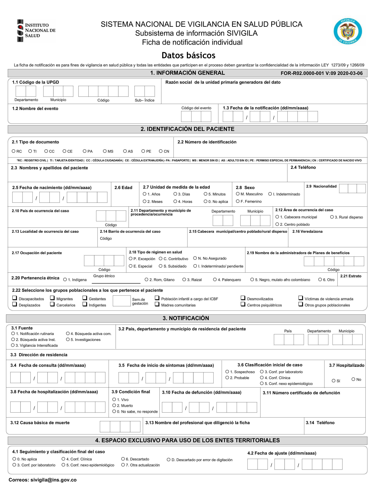

```{=html}
<style>body{text-align: justify;}</style>
```

```{r setup, include=FALSE}
knitr::opts_chunk$set(echo = TRUE)
```

## Introducción

El dengue es una enfermedad viral aguda causada por el virus del dengue (*DENV*), que se transmite a los seres humanos a través de la picadura de mosquitos hembra infectados (*Aedes aegypti*). Esta enfermedad se ha convertido a finales del siglo *XX* y a lo largo del siglo *XXI* en un problema de salud pública en muchas regiones tropicales y subtropicales del mundo. El mayor número de casos de dengue se registró en 2023, con la notificación de 6,5 millones de casos y más de 7 300 muertes relacionadas con la enfermedad, afectando a más de 80 países de todas las regiones de la OMS[@INS2024]. Los diferentes factores demográficos , en el entorno y sociales influyen en la propagación de la enfermedad, por ejemplo, el cambio climático(por ejemplo *El Niño* en 2023) ha incrementado el patrón y frecuencia de precipitaciones en las regiones de América Latina, así como el aumento de la temperatura, lo que ha permitido la proliferación de los mosquitos que transmiten la enfermedad.

En Colombia el dengue ha tenido una fluctuación en cuanto a los casos de dengue en los últimos años, pero, en 2023, inició una nueva fase epidémica de dengue similar a lo observado en algunos países de la región de Américas. Durante este año la incidencia en el país fue de 387,2 casos por 100 000 habitantes superior a la registrada en 2009, 2011, 2012, 2017, 2018, 2021 y 2022; y la letalidad por dengue fue de 0,09 % inferior a las metas establecidas por el gobierno local[@INS2024]. Por lo cual, en nuestro país el dengue se considera un problema de salud pública y se han implementado diferentes estrategias para la prevención y control de la enfermedad debido al potencial epidemiológico de la enfermedad, además, que en el país el vector transmisor de la enfermedad tiene presencia prácticamente todo el país.

El dengue es una enfermedad que supone un riesgo para la salud pública en lugares como Bucaramanga. Es necesario realizar un estudio a partir de los datos reportados a partir de las fichas de notificación individual para casos positivos de dengue suministrados (anonimizados) por el instituto nacional de salud para Bucaramanga, con el fin de identificar los perfiles de riesgo asociados a la enfermedad y obtener información relevante para la toma de decisiones en salud pública.

Para este estudio se empleó un amplio conjunto de datos que incluye detalles sobre los casos de dengue común y grave, así como la mortalidad asociada a esta enfermedad. Estos datos están desagregados según variables como género, edad, ocupación y estado de afiliación al sistema de salud, entre otros aspectos sociales y de salud.

Específicamente se obtienen los datos del sistema de monitoreo epidemiológico de Salud y Protección Social para estudiar diversos aspectos del fenómeno, como los síntomas manifestados por los pacientes afectados y las características demográficas de los grupos de riesgo.

### Objetivo de analisis

El objetivo de este proyecto es analizar los datos de dengue en Bucaramanga para identificar los perfiles de riesgo asociados a la enfermedad mediante un enfoque no supervisado de aprendizaje automático y tecnicas de analisis de datos , logrando asi segmentar y describir a los pacientes en diferentes grupos según sus características, lo que permitirá identificar posibles focos de riesgo y realizar de una manera mas efectiva las campañas de prevención que se realizan.

### Preguntas de investigación

Para el proyecto se plantean las siguientes preguntas de investigación:

1.  ¿Cual es el perfil de las personas que presentaron dengue grave que fallecieron o sobrevivieron?.

2.  ¿Que sintomas se presentan con mayor predominancia en cada uno de los tipos de dengue (sin signos de alarma,con signos de alarma,grave).

3.  Generar grupos (*clusters*) de personas infectadas con el virus del dengue con fines de determinar perfiles e información util para generar campañas de prevención mas focalizadas.

## Metodologia

### Paquetes de R usados

```{r message=FALSE, warning=FALSE}
library(ggplot2)
library(dplyr)
library(tidyverse)
library(lubridate)
library(superml)
library(FactoMineR)
library(factoextra)
library(hrbrthemes)
library(reticulate)

#Algunas Funciones utiles
standard_scaler<-function(x){
  x_std<-c()
  mean_x<-mean(x)
  std_x<-sd(x)
  for(elem in x){
    x_std<-c(x_std,(elem-mean_x)/(std_x))
  }
  return (x_std)
}
```

### Cargando los datos

Los datos que se emplearán en el proyecto corresponde a casos de dengue reportados oficialmente mediante fichas de notificación individual (los registros se encuentran de manera anonima sin ningun tipo de indentificación),como muestra la siguiente figura

{width="217"}

no se encuentran directamente dispuestos para usar en el entorno de R,los datos obtenidos en el portal web de datos.gov [acceso al conjunto de datos originales](https://www.datos.gov.co/Salud-y-Protecci-n-Social/Dengue-Dengue-grave-y-mortalidad-por-dengue-munici/qzc7-jbg3/about_data), portal en el cual se alojan gran cantidad de conjuntos de datos e información abierta para los Colombianos con fines de transparencia y acceso a la información. Para cargar los datos se emplea la función `read_csv` del paquete `readr` que permite leer archivos csv de forma rápida y eficiente para luego ser procesados en un dataframe.Se realizó una muestra de los datos:

```{r}
data<-read_csv('data/data_dengue.csv',show_col_types=FALSE)
```

```{r,echo=FALSE}
knitr::kable(
  head(data), 
  caption = "Datos extraídos y procesados en un dataframe de R"
)
```

Es necesario realizar la aclaración que cada registro corresponde a un caso positivo de dengue de una persona en la ciudad de bucaramanga con datos hasta el 12 de diciembre de 2023.

```{r}
dim(data)
```

El conjunto de datos que se cargó , consta de 10159 observaciones y un total de 78 columnas o features.

### Limpiando los datos

El proceso de limpieza de datos consiste en identificar y corregir los errores y anomalías en los datos, como valores faltantes, valores atípicos y datos duplicados, para garantizar que los datos sean precisos y confiables para el análisis.

### Valores faltantes

Luego de cargar los datos , se debe revisar que cada *feature* (columna del conjunto de datos) no cuente con valores faltantes o *missing values*.

```{r,echo=FALSE}
missing_data=sort(colSums(is.na(data)),decreasing=TRUE)
ggplot()+geom_bar(aes(x=names(head(missing_data,20)),y=head(missing_data,20)),stat="identity",fill='blue')+theme(axis.text.x=element_text(angle=45,hjust=1))+labs(title='Valores faltantes',x='features',y='# de valores faltantes')
```

Se obtuvo que la caracteristica llamada *ocupacion* , esta columna representa el codigo de clasificación de actividad comercial , por lo cual , despues de revisar el estandar para dicho codigo , se determino llenar esos valores faltantes con el valor de 1.

```{r}
data<-data %>% replace_na(list(ocupacion_=1))
#print(sort(colSums(is.na(data)),decreasing=TRUE))
```

```{r,echo=FALSE}
knitr::kable(
  sort(colSums(is.na(data)),decreasing=TRUE), 
  caption = "Valores faltantes en el conjunto de datos"
)
```

### Tipos de datos

Es necesario revisar los tipos de datos de cada columna para asegurarse que sean los adecuados para realizar cálculos , gráficos y analisis. De aquí se determinan que *features* son categóricas y cuáles son numéricas, ya que las categóricas deben recibir un tratamiento especial como lo será la codificación de las mismas.

```{r,echo=FALSE}
knitr::kable(
  sapply(data,typeof), 
  caption = "Tipos de datos en el conjunto de datos"
)
```

Antes de realizar la distinción de datos categóricos y numéricos,se eliminan algunas columnas que no aportan información relevante para el análisis.

```{r}
df<-select(data,-c('orden','cod_eve','grupo','cod_pais_r','version','muesttejid','mueshigado','muesbazo','muesriñon','muesmedula','muesmiocar','muescerebr','muespulmon','nom_eve','cod_ase_','fuente_','con_fin_','grupo_etario','aseguradora'))
dim(df)
```

Después de eliminar las columnas que no aportan información relevante para el análisis, se obtiene un total de 63 columnas.En el conjunto datos,existian algunas *features* que tenían un tipo de dato *character* , por lo cual , se convirtieron a un tipo de dato *date* con el fin de tener una mejor manipulación de datos y posteriormente realizar una mejor limpieza e ingeniería de características.

```{r}
df<-df %>% mutate(across(c(fec_not,fec_con_,fec_hos_,fec_def_,ini_sin_),~ as.Date(.x,format='%d/%m/%Y')))
print(head(df[c('fec_not','fec_con_','fec_hos_','fec_def_','ini_sin_')]))
```

```{r}
categorical_data=c('clasif_edad','sexo_','tip_ss_','per_etn_','estrato_','gp_gestan','gp_mad_com','tip_cas_','famantdngu','COMUNA shp','gp_migrant','gp_discapa','fiebre','cefalea','diarrea','tip_cas_','conducta','clasfinal')
sintomas=c('fiebre','cefalea','dolrretroo','malgias','artralgia','erupcionr','dolor_abdo','vomito','diarrea','somnolenci','hepatomeg','hem_mucosa','hipotermia','aum_hemato','caida_plaq','acum_liqui','extravasac','hemorr_hem','choque','daño_organ')
```

### Limpieza de datos

Cuando se inicia un proyecto que involucra el análisis de datos , los mismos en la mayoría de las ocasiones se encontraran *sucios* , esto quiere decir que limpiar los datos es un proceso de eliminación de errores, valores atípicos e incoherencias (todas estas características se considera *suciedad*), y de garantía de que todos los datos están en un formato adecuado para el análisis[@dataclean]. En primera instancia se analizaron los valores atipicos y los datos erroneos , que en muchas ocasiones , se deben a una mala redacción o información simplemente obsoleta al representar valores atipicos que pueden añadir ruido extremadamente grande al conjunto de datos.

```{r}
summary(df$estrato_)
summary(df$famantdngu)
print(table(df$estrato_))
mean_est=mean(df$estrato_[df$estrato_!=-89])
print(mean_est)
df<-df%>%mutate(estrato_=if_else(estrato_==-89,floor(mean_est),estrato_))
mean(df$estrato_)
table(df$estrato_)

print(table(df$famantdngu))
df<-df%>%mutate(famantdngu=if_else(famantdngu==-89,3,famantdngu))
print(table(df$famantdngu))
```

Los campos que corresponden a campos temporales , mas especificamente fechas , tienen un valor por defecto '1900-01-01'.

### Ingeniería de características

La ingeniería de características implica la extracción y transformación de variables a partir de datos sin procesar,esto puede incluir generar nuevas caracteristicas que tengan información mas util que los datos que se encuentran sin procesar. En este caso , se generaron nuevas caracteristicas a partir de las fechas de notificación, consulta, hospitalización y defunción, con el fin de obtener información relevante para el análisis.La primera nueva caracteristica consistia en el tiempo que una persona diagnosticada de dengue notificaba oficialmente su caso ante las autoridades sanitarias, la segunda caracteristica consistia en el tiempo que una persona diagnosticada de dengue tardaba en acudir a consulta médica, la tercera caracteristica consistia en el tiempo que una persona diagnosticada de dengue tardaba en ser hospitalizada y la cuarta caracteristica consistia en el tiempo que una persona diagnosticada de dengue tardaba en fallecer si ese fuese el caso del paciente .Si no se cumplia el caso (por ejemplo la persona no fallecío), se procedia a asignar un valor de 0 días para la caracteristica en cuestión.

```{r}
df['t_notificacion']<-df$fec_not-df$ini_sin_
df['t_notificacion'][df['t_notificacion']<0]<-duration(0,'days')
df['t_medico']<-df$fec_con_-df$ini_sin_
df['t_medico'][df['t_medico']<0]<-duration(0,'days')
df['t_hospital']<-df$fec_hos_-df$ini_sin_
df['t_hospital'][df['t_hospital']<0]<-duration(0,'days')
df['t_defuncion']<-df$fec_def_-df$ini_sin_
df['t_defuncion'][df['t_defuncion']<0]<-duration(0,'days')
```

Se muestran los resúmenes estadísticos de las nuevas características generadas para verificar que el proceso se hubiese realizado de una manera exitosa

```{r}
summary(as.numeric(df$t_notificacion))
summary(as.numeric(df$t_medico))
summary(as.numeric(df$t_hospital))
summary(as.numeric(df$t_defuncion))
```

### Codificación de datos

Al ir analizando el conjunto de datos , hasta el momento de las 58 características que cuenta el conjunto de datos, tan solo seis de las mismas son numéricas y el resto son categóricas. Entonces la gran presencia de este tipo de variables o características producen que un análisis exploratorio de datos usando parametros estadísticos , como mediana , media , moda ,etc,no tenga mucho sentido en este caso, por lo cual , para los diferentes enfoques que se emplearon para este trabajo , el uso de caracteristicas que involucren datos no númericos (ya que existian algunas características ya categóricas con datos numéricos) , es de nula utilidad,entonces se buscó una solución a dicho problema.La codificación de variables asigna un valor numérico a cada categoría de la característica , existen diversos enfoques , pero , el que se utilizó en este caso fue la codificación de etiquetas o *label-encoding* , que asigna un valor numérico a cada categoria de la característica sin agregar nuevas columnas como el enfoque *one-hot encoding*[@enco].

```{r}
df_n<-select(df,-c('fec_not','fec_con_','fec_hos_','fec_def_','ini_sin_'))
code_var<-c('conducta','clasfinal','tip_ss_','clasif_edad','def_clas_edad','COMUNA shp','BARRIO_VER shp','sexo_')
df_n[code_var]<-lapply(df_n[code_var],factor)
df_n[code_var]<-lapply(df_n[code_var],as.numeric)
```

Ahora se muestra el resumen estadístico de las características codificadas para verificar que el proceso se haya realizado de manera exitosa.

```{r,echo=FALSE}
summary(df_n)
```

Finalmente el conjunto de datos con todo el preprocesamiento realizado anteriormente , ya se encontraba listo para realizar los repectivos analisis estadisticos.Se muestra unos registro del conjunto de datos:

```{r,echo=FALSE}
knitr::kable(
  head(df_n,5), 
  caption='Conjunto de datos final a utilizar' 
)
```

#### Escalado de datos o *feature scaling*

Un paso adicional de preprocesamiento que se realizó al dataframe final , fue aplicarle el proceso de escalado ,en algunos casos le denominan estandarización, pero , esta es una de las técnicas más usadas en este proceso y también le que se empleó en este caso. La estandarización se define de la siguiente manera[@geron2022hands] : $X_{scaled}=\frac{X_i-\mu_{x}}{\sigma_{x}}$ ,permite *estandarizar* las características independientes presentes en los datos en un rango fijo , es útil para manejar magnitudes, valores o unidades muy variables y también muy importante , lograr asimilar la distribución de la características a una distribución normal.

```{r}
df_ns<-as.data.frame(lapply(df_n,standard_scaler))
```

Una muestra del resultado de la transformación

```{r,warning=FALSE,echo=FALSE}
ggplot(data=df_ns,aes(x=t_notificacion))+geom_histogram(fill='blue',bins=39)+labs(title='Distribución de la caracteristica t_notificacion',x='t_notificacion',y='count')+theme_ipsum()
```

### Análisis exploratorio de datos (*EDA*)

El análisis exploratorio de datos o *EDA* , es una técnica crucial en cualquier proyecto que involucre datos,*EDA* trata de analizar características clave, descubrir patrones e identificar relaciones entre variables o *features* del conjunto de datos,estudian y exploraran conjuntos de registros para comprender sus rasgos predominantes, descubrir patrones, localizar valores atípicos e identificar relaciones entre variables. Se empezó con enfoques basicos como agrupaciones o conteos de los datos para tener una idea de la distribución de los mismos.

En primer lugar se contó el número de casos de dengue por clasificación final de la enfermedad, para tener una idea de la distribución de los casos en el conjunto de datos.

```{r}
table(df_n$clasfinal)
```

Caracterizando un poco la población infectada con el virus del dengue en Bucaramanga,se contó el número de casos agrupados por grupo de edad :

```{r}
df_n%>%count(clasif_edad,clasfinal)%>%group_by(clasif_edad)%>%mutate(total_contaguiados_edad=sum(n))
```

la distribución de lo datos es mayoritariamente población masculina , donde para este tipo de población predomino el dengue con signos de alarma , seguido por el dengue sin signos de alarma y por último el dengue grave.La distribución del dengue para el sexo femenino fue similar a la del sexo masculino.Como se muestra a continuación:

```{r}
df_n%>%count(sexo_,clasfinal)%>%group_by(sexo_)%>%mutate(total_contaguiados_sexo=sum(n))
```

#### Analisis de correspondecia (*correspondence analysis*)

El conjunto de datos esta conformado mayoritariamente por variables categoricas , entonces , se eligió el analisis de correspondencia para poder obtener información mas precisa y relevante de los datos , como entender relaciones que puedan existir entre las caracteristicas. Se define el análisis de la correspondencia como una metodología estadística utilizada para identificar y visualizar los patrones ocultos y las asociaciones entre variables categóricas en datos multivariados donde las variables tienen categorías discretas en lugar de valores numéricos[@MCA].En el caso del estudio estadistico que se llevó acabo , esta tecnica resulto muy util ya que es ampliamente usada con datos que son originados a partir de cuestionarios.
El proceso matematico del analisis de correspondencia múltiple que es realmente el metodo que se aplicó al tener varias *features*,  se basa en la descomposición de la matriz de contingencia en valores singulares y la proyección de los datos en un espacio de menor dimensión , el proceso matematico riguroso se obvio un poco por su complejidad.
Se usó la función `MCA` del paquete de R `FactoMineR` para realizar el análisis de correspondencia múltiple.
```{r}
mca<-MCA(data.frame(lapply(df_n[c(categorical_data,sintomas)],factor)),graph=FALSE)
```
La técnica del MCA al emplear el *SVD* genera un conjunto de valores y vectores propios , que lo importante de estos conceptos es generan un número espacio de menor dimensión donde se *compactan* o proyectan los datos individuales en componentes que preservan ciertos porcentajes de la varianza original de los datos.
```{r}
head(get_eigenvalue(mca))
```
En la salida anterior se mostraron del lado de las columnas los componentes o ejes nuevos, resultados del análisis MCA, mientras que en la primera columna se muestran los valores propios que representan la magnitud de las componentes o el tamaño de las varianzas que explica cada uno, mientras que en la segunda columna se muestra el porcentaje de la varianza total que es explicado por cada eje o dimensión. En la tercera columna se muestra el porcentaje de varianza acumulado.
La idea de este análisis es observar principalmente las relaciones entre las variables que se desearon estudiar en el *EDA*,`get_mca_var` es una función que permite obtener las contribuciones de las variables a los componentes principales. 
```{r}
contribs=get_mca_var(mca)$contrib
orden=order(contribs[,'Dim 1'],decreasing=TRUE)
```
```{r,echo=FALSE}
knitr::kable(
  contribs[orden,], 
  caption='Conjunto de datos final a utilizar' 
)
```
Al observar los resultados de contribución , las características *clasfinal* , *conducta* y *fiebre* son las que mas contribuyen al primer componente principal , mientras que las características también de sintomatología fueron más contribuyente a la segunda componente. Esto demuestra que estas variables tienen una gran importancia e influencia en el conjunto de datos , describiendo y representando cada registro por ellas.
El siguiente gráfico presenta las coordenadas o distancias calculadas a partir del al valor de las correlaciones cuadráticas entre las variables y las dimensiones.
```{r,echo=FALSE}
fviz_mca_var(mca,choice="mca.cor",repel=TRUE)
```
```{r}
fviz_mca_var(mca,repel=TRUE,col.var="blue",shape.var=15)
```


### Analisis de componentes principales (PCA)

```{r}
pca<-PCA(df_ns,scale.unit=TRUE,ncp=5,graph=FALSE)
print(pca$eig[1:10,])
pca_plot<-as.data.frame(pca$ind$coord[,1:2])
pca_plot$clasfinal<-df_n$clasfinal
pca_plot_filtered<-pca_plot%>%filter(Dim.1>=-5&Dim.1<=5,Dim.2>=-5&Dim.2<=5)
fviz_screeplot(pca,ncp=5)
```

```{r message=FALSE, warning=FALSE}
ggplot(pca_plot_filtered,aes(x=Dim.1,y=Dim.2,alpha=factor(clasfinal),color=factor(clasfinal),shape = factor(clasfinal)))+geom_point(size=4)+labs(title="Pacientes de Dengue en Bucaramanga",x="Componente Principal 1 (PC1)",y="Componente Principal 2 (PC2)")+theme_ipsum()
```

## Resultados

```{r}
for (var in categorical_data) {
  df_counts <- df %>%
    group_by(!!sym(var))%>%summarise(count=n(),.groups="drop")
  p<-ggplot(df_counts,aes(x=!!sym(var),y=count,fill=!!sym(var))) +
    geom_bar(stat="identity")+labs(title=paste("Distribución de la caracteristica",var),x=var,y="Frecuencia")+theme(axis.text.x = element_text(angle = 45, hjust = 1),legend.position = "none")
  print(p)
}
```

Se obtuvo que el dengue con signos de alarma (representado por 1) es el que mayormente presentaron los ciudados infectados por el virus en la ciudad de Bucaramanga , seguido por el dengue sin signos de alarma (representado por 2) y unicamente 26 casos de dengue en su forma grave

El grupo de edad que se contaguio mas con el virus del dengue fue el grupo de edad de 29 a 59 años que contó, seguido por el grupo de edad de 30 a 39 años y el grupo de edad de 18 a 28 años.Se observó lgo interesante , el grupo poblacional de mas de 60 años fue el menos afectado por el virus del dengue.

```{r}
ggplot(data=df,aes(x=factor(año)))+geom_bar(fill="red")+labs(title='Distribución de los casos de dengue por año',x='año',y='frecuencia')
```

```{r}
df['COMUNA shp']
```

```{python}
print('hello')
```

## Analisis de resultados y discusión

## Conlusiones

## References
